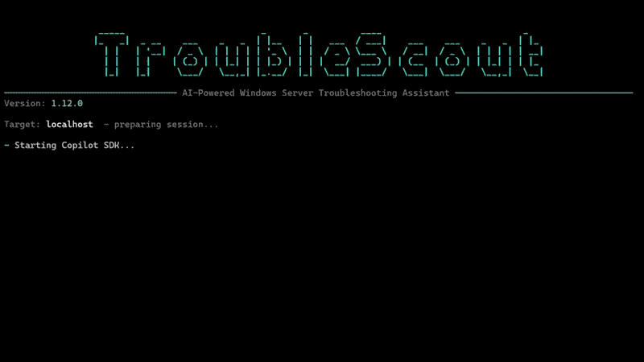

# TroubleScout



[](https://github.com/sasler/TroubleScout/actions/workflows/build.yml)
[](https://github.com/sasler/TroubleScout/actions/workflows/tests.yml)
[](https://github.com/sasler/TroubleScout/actions/workflows/branch-protection.yml)
[](https://github.com/sasler/TroubleScout/actions/workflows/release.yml)

## Description

TroubleScout is an AI-powered troubleshooting assistant for Windows. It was originally designed for Windows Server, but it also works well on regular Windows clients. It uses the [GitHub Copilot SDK](https://github.com/github/copilot-sdk) to investigate issues with safe PowerShell-based diagnostics.

If you just want to get started, jump to [Installation](#installation).

## Prompt Examples

| Prompt | Description |
| --- | --- |
| How is this computer doing? | Get a general health check for the local machine or target server. |
| Find out why the server restarted unexpectedly last night. | Review recent shutdown and restart events to identify the likely cause. |
| D volume is getting full. Is this normal growth? | Check disk usage, recent growth, and the most likely sources of storage pressure. |
| Why are users complaining that logons are slow? | Investigate authentication, profile, service, and performance issues affecting sign-in speed. |
| Check why the SQL Server service is stopped. | Inspect service state, recent failures, dependencies, and related event log entries. |
| What changed on this machine after the last patch window? | Correlate updates, restarts, and new warnings or errors after maintenance. |
| CPU usage is high. What is driving it? | Identify the busiest processes, services, and counters behind sustained CPU pressure. |
| Compare the health of these two servers and tell me what stands out. | Use a multi-server session to spot differences across systems quickly. |

## Main Features

- **Natural language troubleshooting**: Ask questions in plain English instead of building diagnostic command sequences yourself.
- **Safe by default**: Read-only commands run automatically, while system-changing actions require approval.
- **Local or remote troubleshooting**: Work against the current machine or connect to remote systems over WinRM.
- **Multi-server sessions**: Start with several servers at once or add more during the session.
- **JEA support**: Connect to constrained PowerShell remoting endpoints with [Just Enough Administration](https://learn.microsoft.com/en-us/powershell/scripting/security/remoting/jea/overview).
- **HTML report**: Generate a session report with `/report` when you want a shareable troubleshooting summary.
- **Interactive terminal UI**: Streamed responses, session status, prompt history, and cancellation are built into the console experience.
- **Model and provider flexibility**: Use GitHub Copilot by default or switch to OpenAI-compatible BYOK mode if needed.
- **Reasoning visibility**: Supported reasoning models can show their thinking output and let you adjust reasoning effort.
- **MCP and skills support**: Load MCP servers and Copilot skills to extend what TroubleScout can access and automate.

## Installation

### Recommended: WinGet

Install TroubleScout:

```powershell
winget install sasler.TroubleScout
```

Start TroubleScout:

```powershell
troublescout
```

That is the main path most users need. If you need to sign in to GitHub Copilot, you can do it from inside TroubleScout with `/login`.

### Manual installation

If you do not want to use WinGet, download the latest release from [Releases](https://github.com/sasler/TroubleScout/releases), extract `TroubleScout.exe` and the `runtimes/` folder when it is included, then run:

```powershell
TroubleScout.exe
```

## Usage

### Start an interactive session

```powershell
troublescout
```

By default, TroubleScout starts locally, so you can immediately ask questions such as `How is this computer doing?`.

### Connect to a remote server from the start

```powershell
troublescout --server myserver.domain.com
```

### Ask one question in headless mode

```powershell
troublescout --server myserver.domain.com --prompt "Check why the SQL Server service is stopped"
```

### Start with more than one server

```powershell
troublescout --server dc01 --server files01 --server sql01
```

You can also pass a comma-separated list such as `--server dc01,files01,sql01`.

### Start with a JEA session

```powershell
troublescout --server server1 --jea server2 JEA-Admins
```

## Reports And Session Tools

These are useful once you are already in TroubleScout:

- `/status` shows the current connection, model, execution mode, and session details.
- `/history` shows PowerShell command history.
- `/report` generates and opens an HTML session report.
- `/clear` starts a fresh AI session.

## Safety Model

TroubleScout is designed to investigate first and change things only with your approval.

- Read-only commands such as `Get-*` run automatically.
- Mutating commands such as `Set-*`, `Start-*`, `Stop-*`, `Restart-*`, `Remove-*`, and similar actions require confirmation.
- Sensitive commands such as `Get-Credential` and `Get-Secret` are blocked.

When approval is required, TroubleScout offers a `Yes`, `No`, or `Explain` choice so you can review the action before allowing it.

## Authentication And Models

### GitHub mode

GitHub Copilot is the default path. If you are not authenticated yet, start TroubleScout and use `/login`.

### BYOK mode

If you want to use an OpenAI-compatible provider instead, configure it from inside TroubleScout with `/byok`.

Useful related options:

- `--model` selects a specific model.
- `--openai-base-url` points to a compatible endpoint.
- `--openai-api-key` passes the API key directly.
- `/model` switches models interactively.
- `/reasoning` sets the reasoning effort for supported models.
- `/byok` configures or switches BYOK mode from inside the app.

## Remote Troubleshooting

For remote troubleshooting, WinRM must be enabled on the target machine and reachable from the system running TroubleScout. Windows Integrated Authentication is used for standard remote sessions.

Useful remote workflows:

- `troublescout --server myserver.domain.com` starts on a remote server.
- `/server srv1 srv2` or `/server srv1,srv2` adds more servers during an interactive session.
- `/jea` walks you through connecting to a JEA endpoint.

## MCP Servers And Skills

TroubleScout can load MCP servers and Copilot skills through session configuration.

- Default MCP config path: `%USERPROFILE%\\.copilot\\mcp-config.json`
- Default skills path: `%USERPROFILE%\\.copilot\\skills`
- `/capabilities` shows configured and runtime-used MCP servers and skills, which are also visible in `/status`.
- `/mcp-role` assigns optional monitoring and ticketing MCP role mappings.
- MCP and URL approvals can be remembered for the current TroubleScout session.

## Interactive Commands

A short reference is shown below. The full per-command documentation lives in
[docs/slash-commands.md](docs/slash-commands.md).

| Command | Description |
| --- | --- |
| `/help` | Show the interactive command reference. |
| `/status` | Show connection, model, mode, usage, and capability details. |
| `/clear` | Start a new AI session. |
| `/settings` | Open `settings.json`, then reload prompt and safety configuration. |
| `/mcp-role` | Configure monitoring and ticketing MCP role mappings. |
| `/model` | Choose another model or provider. |
| `/reasoning [auto or effort]` | Set reasoning effort for the current model when supported. |
| `/mode <safe or yolo>` | Change the PowerShell execution mode. |
| `/server server1 [server2 ...]` | Connect to one or more additional servers, using spaces or commas. |
| `/jea [server] [configurationName]` | Connect to a JEA constrained endpoint. |
| `/login` | Run GitHub Copilot login inside TroubleScout. |
| `/byok env or <api-key> [base-url] [model]` | Enable OpenAI-compatible BYOK mode. |
| `/byok clear` | Clear saved BYOK settings for this profile. |
| `/capabilities` | Show configured and used MCP servers and skills. |
| `/history` | Show PowerShell command history. |
| `/report` | Generate and open the HTML session report. |
| `/exit` or `/quit` | End the session. |

## Command-Line Reference

| Option | Description |
| --- | --- |
| `--server`, `-s` | Target server name or IP. Repeat it or use a comma-separated list for multi-server startup. |
| `--prompt`, `-p` | Run a single prompt in headless mode. |
| `--jea <server> <configurationName>` | Preconnect one JEA session at startup. |
| `--model`, `-m` | Select a model such as `gpt-4.1`. |
| `--mode <safe or yolo>` | Set the PowerShell execution mode. |
| `--mcp-config` | Set a custom MCP config path. |
| `--skills-dir` | Add an extra skills directory. |
| `--disable-skill` | Disable a loaded skill by name. |
| `--debug`, `-d` | Show technical diagnostics and exception details. |
| `--byok-openai` | Use an OpenAI-compatible provider instead of GitHub authentication. |
| `--no-byok` | Force GitHub Copilot even if BYOK is saved in settings. |
| `--openai-base-url` | Override the OpenAI-compatible endpoint URL. |
| `--openai-api-key` | Provide the OpenAI-compatible API key directly. |
| `--version`, `-v` | Show the app version and exit. |
| `--help`, `-h` | Show command-line help. |

## Manual Build From Source

Most users do not need this section. It is for contributors and advanced users.

```powershell
git clone https://github.com/sasler/TroubleScout.git
cd TroubleScout
dotnet build
```

To publish a self-contained executable:

```powershell
dotnet publish -c Release -r win-x64 --self-contained true -p:PublishSingleFile=true
dotnet publish -c Release -r win-arm64 --self-contained true -p:PublishSingleFile=true
```

## Troubleshooting

Most users can ignore this section. If you installed with WinGet and `troublescout` starts normally, you do not need to install anything else.

### Copilot login or startup problems

If TroubleScout cannot reach GitHub Copilot, first try `/login` inside the app. Only if startup still fails should you check the underlying Copilot CLI installation:

```powershell
copilot --version
```

Official setup guide for advanced troubleshooting: [Install Copilot CLI](https://docs.github.com/en/copilot/how-tos/set-up/install-copilot-cli)

### Remote server connectivity problems

If remote sessions fail, confirm that WinRM is enabled on the target system and reachable from your machine.

```powershell
Enable-PSRemoting -Force
```

### SDK or CLI compatibility issues

This usually matters only for advanced setups where you manage the Copilot CLI separately instead of relying on the normal app installation path.

```powershell
winget install --id OpenJS.NodeJS.LTS -e --accept-package-agreements --accept-source-agreements
```

## Architecture

```text
Program.cs (CLI entry) -> TroubleshootingSession (Copilot integration)
                                   |
        +--------------------------+--------------------------+
        |                          |                          |
  UI/ConsoleUI.cs         Tools/DiagnosticTools.cs   Services/PowerShellExecutor.cs
```

For a deeper component map, request flow, and the approval pipeline, see
[docs/architecture.md](docs/architecture.md).

## Environment Variables

| Variable | Description |
| --- | --- |
| `COPILOT_CLI_PATH` | Custom path to the Copilot CLI executable. |
| `OPENAI_API_KEY` | API key for OpenAI-compatible BYOK mode. |
